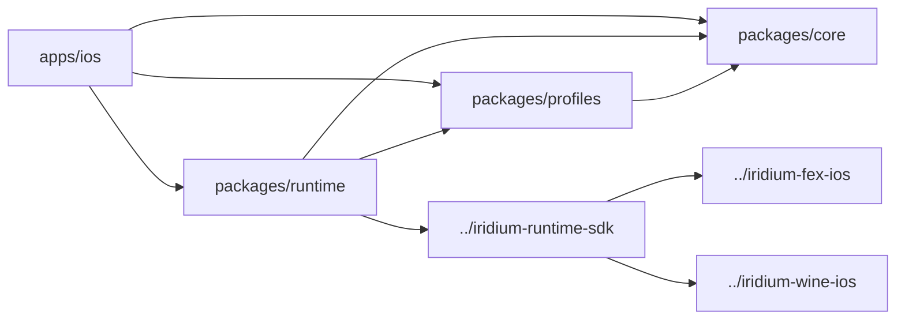

# Architecture

This document describes the target architecture for Iridium. It reflects the current repository layout, the package seams already present in the main repo, and the sibling runtime repos that now own the real engine-port work.

## Goals

- Keep the shipping app shell small and replaceable.
- Isolate stable shared types from performance-sensitive runtime logic.
- Make compatibility and launch-readiness decisions explicit instead of scattering them through the app.
- Support phased delivery: land the import/prefix/runtime shell first, then land the real engine without reopening the architecture.

## Module boundaries

### `apps/ios`

Owns the iOS entry point, app lifecycle, scene wiring, entitlement configuration, and platform-specific integration. It should translate user and OS events into package APIs, not become the main home for domain or runtime behavior.

The current app shell already renders:

- Library and game detail views backed by the shared store.
- Onboarding and runtime checks derived from JIT and runtime health.
- Prefix and settings surfaces that mutate the shared state.
- Pending-launch and queued-resume UX owned by store/runtime truth.

### `packages/core`

Owns the stable building blocks:

- Domain models and value types.
- Shared configuration schemas.
- Persistence-facing contracts.
- Cross-package utilities that do not depend on device capability or frame timing.

`core` should have the fewest dependencies and the strongest API discipline.

The current implementation already includes:

- Persisted JSON snapshot storage for app state.
- Prefix lifecycle and runtime health records.
- Service protocols and a durable `IridiumStore` actor used by the app shell.
- Extended durable records for prefix manifests/bootstrap status, executable fingerprints, validation evidence, pending launches, and runtime host session history.

### `packages/profiles`

Owns compatibility presets and legacy tuning metadata. The current package already defines:

- built-in broad-catalog compatibility presets
- lookup helpers
- legacy device-tier-backed tuning defaults that still exist in code but should not be treated as product launch gates

This package should remain the single source of truth for broad compatibility defaults, but not for user-visible launchability claims.

### `packages/runtime`

Owns live execution concerns:

- Bundled runtime descriptors.
- JIT readiness and runtime health hooks.
- Host capability inventory and runtime bundle validation.
- Launch-readiness truth derived from explicit host/runtime facts such as `launchReady` and `launchStatusSummary`.
- Managed artifact fingerprinting and runtime artifact registration.
- Import scanning and executable ranking.
- Prefix bootstrap manifest generation for direct launch.
- Native runtime-host submission, execution monitoring, telemetry collection, and mitigation coordination.
- Compatibility evidence resolution, explicit whitelist policy, and the manual validation harness.

`runtime` can depend on `core` and `profiles`. `profiles` can depend on `core`. `core` should remain dependency-light.

### Sibling runtime repos

The real engine-port work is intentionally split out of the main app repo:

- `../iridium-runtime-sdk`
  - owns the native runtime host SDK, embedded host core, macOS harness entrypoint, and runtime-bundle assembly
- `../iridium-fex-ios`
  - owns the source-owned FEX fork and the iOS embedding bridge surface
- `../iridium-wine-ios`
  - owns the source-owned Wine fork, iOS userland build path, and direct-launch bridge surface

Engine-port work should land in those repos unless it changes a stable contract that the main app repo consumes.

## Planned dependency shape

## Runtime flow

1. `apps/ios` boots the app and gathers platform signals.
2. `runtime` provisions and validates the bundled runtime, then probes host capability state.
3. `core` loads the persisted snapshot and exposes library, pending-launch, prefix, launch-history, and runtime-health state.
4. `profiles` resolves the relevant title-class and compatibility defaults.
5. `runtime` emits launch packages and host submissions through the bundled-device backend contract.
6. `../iridium-runtime-sdk` owns the embedded host path and runtime-bundle assembly.
7. `../iridium-fex-ios` and `../iridium-wine-ios` are the eventual engine implementation behind that host path.
8. The app shell renders onboarding, library, prefix, and settings state and handles platform-specific presentation.

## Architectural guardrails

- Do not place reusable business logic in `apps/ios`.
- Do not let `runtime` invent compatibility policy that should live in `profiles`.
- Do not let `profiles` depend on transient UI or app lifecycle details.
- Do not move engine-port work back into the Swift packages or SwiftUI shell unless a stable contract truly needs to change.
- Do not reintroduce user-visible launch gating based on abstract device tiers.
- Favor explicit data passed across package boundaries over hidden globals.
- Add tests at the package boundary where the policy or behavior becomes observable.

## What is intentionally deferred

- A true playable iPhone Wine/FEX engine beyond the current host/bridge seams.
- Production Steam networking and content transfer on top of the same bundled local runtime path.
- Production persistence beyond the current JSON snapshot backend.
- Fleet telemetry aggregation and analytics beyond the current local runtime telemetry snapshot path.

Those decisions remain deferred, but the app/store/runtime seams now exist and are exercised by tests so the repo can harden them without re-architecting the app shell. The current physical-device blocker is now specific and explicit: local launch/playability readiness can be derived from real registered services, but a physical iPhone still must prove that the Wine/FEX path renders a first frame, receives input, initializes audio, and remains in a running session without development-only readiness overrides.

## Runtime contract maintenance

Use `RuntimeEnvironmentKey` for Swift runtime environment keys and
`iridium_runtime_host_contract.hpp` for native host keys. Add new keys to their
owning contract before using them at call sites or in tests. Preserve public
Swift package products, C headers, runtime bundle layout and the bridge ABI.
Limit changes to upstream Wine and FEX code to those needed by the integration.
